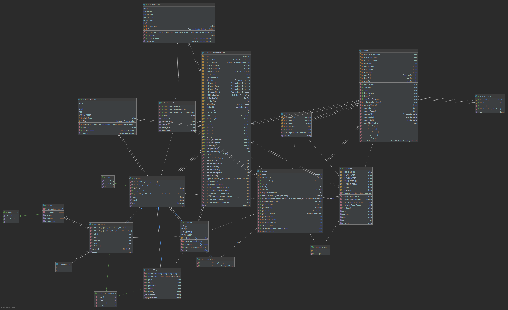

<!--
AUTH: Jared O'Toole
DATE: Wed, Sep 11th, 2019
PROJ: ProductionLineTracker
FILE: README.md

A description of the project.
-->

# ProductionLineTracker
This is my OOP project submission for Professor Vanselow's [COP3003: Object Oriented Programming](https://sites.google.com/site/profvanselow/course/cop-3003/oop-project)
class at Florida Gulf Coast University for the 2019 fall semester. It is a Java FX application that simulates a production line management system.

## Demonstration


## Documentation
[JavaDoc](https://Architecture4less.github.io/ProductionLineTracker/doc/index.html)

**Since private repositories cannot use GitHub pages through a free account, this link will not work.
The documentation is still available in the 'doc' folder.

## Diagrams

The project's classes diagram:



---

The project's database diagram:


## Getting Started

This project was made using JDK 1.8.0.
The only dependency is an H2 Driver, which is included in the 'lib' folder.

## Built With
- JetBrain's IntelliJ IDEA Ultimate
- Gluon's Scene Builder

<!-- ## Contributing -->

## Author

Jared O'Toole <jwotoole9141@eagle.fgcu.edu>

<!-- ## License -->

<!-- ## Acknowledgments -->

<!-- ## History -->

## Key Programming Concepts Utilized

- Creating a GUI application using JavaFX
- Designing a GUI, using Scene Builder to generate the fxml file
- Applying a CSS style sheet to a JavaFX application
- Creating and interacting with a database using JDBC

## Problem Statement

**Scenario**

You have been hired to create software for a media player production facility that will keep track of what products are produced.

Without the software, workers on the production floor are physically producing items and having to write down what is produced in a production log book.

Management would like the production tracking to be more automated so the workers don't need to spend as much time recording what was produced, the log will be more accurate, and it will be easier to generate production reports.

In addition to the ability to record production, the software also needs the ability to add to the product line (the catalog of products that are able to be produced).

-   **Goals** (high level intended outcomes; for software, a Product Backlog)
    -   Hypothetical / Real world
        1.  Allow a user to add new products that are able to be produced and store them in a collection.
        2.  The collection of products that can be produced can be displayed at any time.
        3.  Allow a user to track production of products, including specifying how many items of that product were created. The program will then create a record for each of these items and store them in a collection.
        4.  The collection of created items can be displayed at any time.
        5.  Production statistics can be displayed – Total items produced, number of each item type, the number of unique products created etc.
        6.  Employee accounts can be made.
        7.  Allow easy modification to handle different products.
    -   Actual / For class
        1.  Solidify understanding of object oriented programming.
        2.  Practice Java.
        3.  Learn basic graphical user interface (GUI) programming.
        4.  Learn basic database programming.
-   **Boundaries / Scope** (where the functions and responsibilities of the solution start and end / what it should do and what is left to other systems to do)
    -   Hypothetical / Real world
        -   For this particular production facility you will only need to track music and movie players.
        -   The program does not need the ability to place or fulfill orders / reduce stock, just track production.
    -   Actual / For class
        -   TBD
-   **Success criteria** (set of conditions to be satisfied at completion; must be measurable and verifiable, like a test)
    -   Hypothetical / Real world
        -   Pass tests (in repl.it)
        -   Follow rules for documentation, style, and coding conventions
    -   Actual / For class
        -   Grading forms / rubrics (in Canvas)
            -   Documentation (see below)
            -   Style (see below)
            -   Quality (see below)
            -   Assignment Specifications - include full project in your repository so your program can be easily imported and run.
        -   Creation of artifact for portfolio
-   **Constraints** (externally imposed limitations on system requirements, design, or implementation or on the process used to develop or modify a system)
    -   Hypothetical / Real world
        -   The program will be a GUI database program written in Java.
        -   The program must be flexible to allow for future expansion.
        -   Code should be saved to a private GitHub repository.
        -   Follow best practices for style, documentation, and quality.
    -   Actual / For class
        -   Communication and collaboration with classmates is allowed but should not extend to sharing actual code.
-   **Assumptions** (things that are accepted as true or as certain to happen, without proof)
    -   You like to program.
    -   You have foundational knowledge of programming from prerequisite courses.
    -   You will spend at least 4 hours per week on the project.
    -   The project should not require more than 7 hours per week. If so, contact the professor for assistance.
    -   This will help you be successful in future classes and your career.
-   **Stakeholders** (individuals or organizations having a right, share, claim, or interest in a system or in its possession of characteristics that meet their needs and expectations )
    -   Hypothetical / Real world
        -   CEO
        -   CTO
        -   CIO
        -   users
            -   production facility workers
            -   inventory managers
        -   customers
        -   I.T. support
    -   Actual / For class
        -   Yourself
        -   Future potential employers
        -   Professor
-   **Timelines** (a breakdown of the Product Backlog into time-bound smaller, more detailed tasks in Sprint Backlogs)
    -   Three 5-week sprints, detailed below.

## Sprint 1

_GUI, basic database_

### Week 1

- [X] Create JavaFX project. See [IntelliJ](https://sites.google.com/site/profvanselow/course/cop-3003/intellij) page and [IntelliJ Help](https://www.google.com/url?q=https%3A%2F%2Fwww.jetbrains.com%2Fhelp%2Fidea%2Fpreparing-for-javafx-application-development.html&sa=D&sntz=1&usg=AFQjCNGfhsMWgBGucMqbhHbov50HxK9IPA)
- [X] Share to private repository on GitHub. See [GitHub](https://sites.google.com/site/profvanselow/programming/github) page.
- [X] Create README. Details in Documentation Expectations at bottom of page.

### Week 2

- [X] Add a tab view with three tabs: Product Line, Produce, and Production Log
- [X] Add a CSS file with some code [TutorialsPoint](https://www.google.com/url?q=https%3A%2F%2Fwww.tutorialspoint.com%2Fjavafx%2Fjavafx_css.htm&sa=D&sntz=1&usg=AFQjCNHb6EOyEfxXN72rudasuZJ9R2P6HQ)  [Reference](https://www.google.com/url?q=https%3A%2F%2Fdocs.oracle.com%2Fjavafx%2F2%2Fapi%2Fjavafx%2Fscene%2Fdoc-files%2Fcssref.html&sa=D&sntz=1&usg=AFQjCNHwozleprI88eJmJ_g5YCFMQ7fETA)
- [X] Quality expectations: see course website
- [X] Style expectations: see course website
- [X] Documentation expectations: see course website

### Week 3

- In the Product Line tab
    - In the AnchorPane
        - [X] Add a 2x3 GridPane
            - [X] Add a Label and text field for Product Name in row 0, columns 0 and 1
            - [X] Add a Label and text field for Manufacturer in row 1, columns 0 and 1
            - [X] Add a Label and ChoiceBox for Item Type in row 2, columns 0 and 1
        - [X] Add a Button that says Add Product
            - [X] Add an event handler to the button click event. For now, just have it print to the console (System.out.println)
        - [X] Add a Label and a Table View for Existing Products
- In the Produce tab
    - In the AnchorPane
        - [X] Add a Label and ListView for Choose Product
        - [X] Add a Label and ComboBox (data type String) for Choose Quantity
        - [X] Add a Button that says Record Production
            - For now, just have the button print to the console (System.out.println)
- In the Production Log tab
    - In the AnchorPane
        - [X] Add a TextArea

### Week 4

- [X] Install database software if necessary
- [X] Create database in a res folder at same level as src folder
	- See course website for example
- [X] Connect to database
    -   You will get a FindBugs error for not having a password or including the password. Eventually you will retrieve the password from another file but you don't need to worry about this for now.
- [X] Make sure to commit and push your res folder to the remote repository.

### Week 5

- [X] Use a controller for almost all code.
- [X] In the Product Line tab, for the Add Product button event handler, add code to insert a product into the database
    - You could hard code this statement (for now) or build from the user interface, like `INSERT INTO Product(type, manufacturer, name) VALUES ( 'AUDIO', 'Apple', 'iPod' );` See [JDBC - Insert Records Example](https://www.google.com/url?q=https%3A%2F%2Fwww.tutorialspoint.com%2Fjdbc%2Fjdbc-insert-records.htm&sa=D&sntz=1&usg=AFQjCNHuTo0mo6fnSqkICMWOAf1_-YINHQ)
    - To avoid a FingBugs error, use a Prepared Statement. See [JDBC PreparedStatement](http://www.google.com/url?q=http%3A%2F%2Ftutorials.jenkov.com%2Fjdbc%2Fpreparedstatement.html&sa=D&sntz=1&usg=AFQjCNHudvfsvi60EPJ3NYo9vrUTh9wA1g)
    - [ ] For now, every time a product is added to the database, output the full list of products to the console.
- In the Produce tab, for the ComboBox
    - [X] Populate with values 1-10 in an [_initialize_ method](https://www.google.com/url?q=https%3A%2F%2Fdocs.oracle.com%2Fjavase%2F8%2Fjavafx%2Fapi%2Fjavafx%2Ffxml%2Fdoc-files%2Fintroduction_to_fxml.html%23controllers&sa=D&sntz=1&usg=AFQjCNG4hDHXzG52UWyZa9Qo9_EznSi24Q) in the Controller
    - [X] To allow the users to enter other values in the combobox, call the method `setEditable(true);`
    - [X] To show a default value, call the method `getSelectionModel().selectFirst();`
- [X] Prepare for submission

## Sprint 2

### Week 6

> Enum, Interface, Abstract Class

- [x] **Issue 1 - Product**
- [x] All items will have a pre-set type. Currently there are 4 types. Create an **enum** called ItemType that will store the following information:
    
    _Type_ | _Code_
    --- | ---
    Audio | AU
    Visual | VI
    AudioMobile | AM
    VisualMobile | VM
    
    - See [Enum Types](https://www.google.com/url?q=https%3A%2F%2Fdocs.oracle.com%2Fjavase%2Ftutorial%2Fjava%2FjavaOO%2Fenum.html&sa=D&sntz=1&usg=AFQjCNEqSBXgT_50iDGl7XnYvKFMBKDmRQ) The Java™ Tutorials
    
- In the Product Line tab
  - [X] Fill the ChoiceBox with the types using an enhanced for loop.
  - [X] Update your code to insert a product to use the choicebox selected item. 

- [x] Create an interface called Item that will force all classes to implement the following functions.
  - A method getId that would return an int
  - A method setName that would have one String parameter
  - A method getName that would return a String
  - A method setManufacturer that would have one String parameter
  - A method getManufacturer that would return a String
  - See [Java - Interfaces](https://www.google.com/url?q=https%3A%2F%2Fwww.tutorialspoint.com%2Fjava%2Fjava_interfaces.htm&sa=D&sntz=1&usg=AFQjCNFgbby7R0aifb91_APeXmoW4s7HqA) tutorialspoint

- [x] Create an abstract type called Product that will implement the Item interface. Product will implement the basic functionality that all items on a production line should have. Add the following fields to Product
  - int id
  - String type
  - String manufacturer
  - String name

- [x] Complete the methods from the interface Item.
- [x] Add a constructor that will take in the name of the product and set this to the field variable name.
- [x] Add a toString method that will return the following: (example data shown).
    ```
    Name: iPod
    Manufacturer: Apple
    Type: AM
    ```
- [X] To test the Product class, temporarily create a Widget class that extends Product. Store a created Widget object to the database and a productLine collection.

### Week 7

> Inheritance

- [X] **Issue 2 - AudioPlayer**
- [X] All of the items on this production line will have basic media controls. Create an interface called MultimediaControl that will define the following methods which don't need to return anything.
  - play()
  - stop()
  - previous()
  - next();
  
- [X] We require a concrete class that will allow us to capture the details of an audio player. Create a class called AudioPlayer that is a subclass of Product and implements the MultimediaControl interface.
  - The class will have 2 fields
  - String audioSpecification
  - String mediaType
  
- [X] Create a constructor that will take in 3 parameters – name, manufacturer, and audioSpecification.
- [X] The constructor should call its parents constructor and also setup the media type.
- [X] Implement the methods from the MultimediaControl interface by simply writing the action to the console.
   - E.g. in play `System.out.println("Playing");` Normally we would have code that would instruct the media player to play, but we will simply display a message.
   
- [X] Create a toString method that will display the superclass's toString method, but also add rows for Audio Spec and Type.
- [X] Create a driver class for AudioPlayer that will test to see whether we can instantiate occurrences of it, use the media controls and print out their details to the console.

#### Week 8

> Polymorphism

- [ ] **Issue 3 - Production**

The production facility will also create portable movie players. The main difference between these and the audio players is that they contain screens. 

- [ ] Create an enum called MonitorType that will store

    Type |
    --- |
    LCD |
    LED |

- [ ] Create an interface called ScreenSpec. This will define 3 methods:
  - public String getResolution();
  - public int getRefreshRate();
  - public int getResponseTime();

- [ ] Create a class called Screen that implements ScreenSpec. Add three fields
  - String resolution
  - int refreshrate
  - int responsetime

- [ ] Complete the methods from the ScreenSpec interface.
- [ ] Add a toString method that will return the details of the 3 field in the same format as the Product Class.
- [ ] Create a Driver class for Screen that tests the functionality of the screen class.
- [ ] Create a class called MoviePlayer that extends Product and implements MultimediaControl.
- [ ] Add 2 fields to this class called screen and monitor type and assign appropriate types to them.
- [ ] Complete the methods from the MultimediaControl interface in a similar fashion to the audio player.
- [ ] Create a toString method that calls the product toString, displays the monitor and the screen details.
- [ ] Create a diver class to test the functionality of the movie player.

### Week 9

> Polymorphism

- [ ] **Issue 4 - MoviePlayer**

Allow the user to record production of a given product. 

- [ ] Create a Production class and table. The user should be able to input a quantity. 

- [ ] Create a production record for each produced item. 
  - [ ] Set manufacturedOn as the current date and time. 
  - [ ] Store each record in a productionRun collection. 
    - [ ] Store the contents of the collection to a Production table in the database. 
    - [ ] Display the contents of the Production table in a TextView.

- [ ] In the Add Product event handler, declare a Product.
- [ ] Depending on the chosen item type, assign a new AudioPlayer object or MoviePlayer object to the Product, using the input from the form elements.

### Week 10

> Encapsulation

- [ ] **Issue 5 - MultimediaControl**

- [ ] The audio players and the movie players share the same control interface on the physical devices. The control interface does not care if the device is a video player or an audio player. 
- [ ] Create a driver class that will demonstrate that any class that implements the MultimediaControl Interface would be able to be instantiated and use its methods used no matter if it was an audio or movie player.

## Sprint 3
