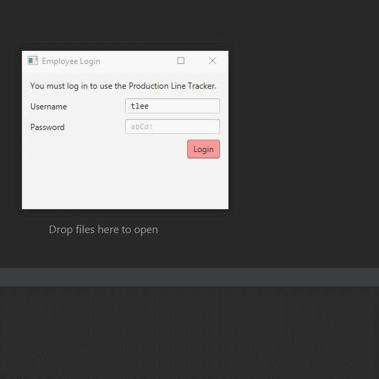
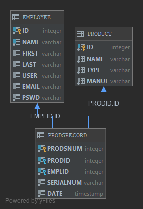

<!--
AUTH: Jared O'Toole
DATE: Wed, Sep 11th, 2019
PROJ: ProductionLineTracker
FILE: README.md

A description of the project.
-->

# ProductionLineTracker
This is my OOP project submission for Professor Vanselow's [COP3003: Object Oriented Programming](https://sites.google.com/site/profvanselow/course/cop-3003/oop-project)
class at Florida Gulf Coast University for the 2019 fall semester. It is a Java FX application that simulates a production line management system.

## Demonstration

## Documentation
[JavaDoc](https://Architecture4less.github.io/ProductionLineTracker/doc/index.html)

**Since private repositories cannot use GitHub pages through a free account, this link will not work.
The documentation is still available in the 'doc' folder.

## Diagrams

The project's classes diagram:

---

The project's database diagram:

## Getting Started

This project was made using JDK 1.8.0.
The only dependency is an H2 Driver, which is included in the 'lib' folder.

## Built With
- JetBrain's IntelliJ IDEA Ultimate
- Gluon's Scene Builder

<!-- ## Contributing -->

## Author

Jared O'Toole <jwotoole9141@eagle.fgcu.edu>

<!-- ## License -->

<!-- ## Acknowledgments -->

<!-- ## History -->

## Key Programming Concepts Utilized

- Creating a GUI application using JavaFX
- Designing a GUI, using Scene Builder to generate the fxml file
- Applying a CSS style sheet to a JavaFX application
- Creating and interacting with a database using JDBC

## Problem Statement

**Scenario**

You have been hired to create software for a media player production facility that will keep track of what products are produced.

Without the software, workers on the production floor are physically producing items and having to write down what is produced in a production log book.

Management would like the production tracking to be more automated so the workers don't need to spend as much time recording what was produced, the log will be more accurate, and it will be easier to generate production reports.

In addition to the ability to record production, the software also needs the ability to add to the product line (the catalog of products that are able to be produced).

-   **Goals** (high level intended outcomes; for software, a Product Backlog)
    -   Hypothetical / Real world
        1.  Allow a user to add new products that are able to be produced and store them in a collection.
        2.  The collection of products that can be produced can be displayed at any time.
        3.  Allow a user to track production of products, including specifying how many items of that product were created. The program will then create a record for each of these items and store them in a collection.
        4.  The collection of created items can be displayed at any time.
        5.  Production statistics can be displayed – Total items produced, number of each item type, the number of unique products created etc.
        6.  Employee accounts can be made.
        7.  Allow easy modification to handle different products.
    -   Actual / For class
        1.  Solidify understanding of object oriented programming.
        2.  Practice Java.
        3.  Learn basic graphical user interface (GUI) programming.
        4.  Learn basic database programming.
-   **Boundaries / Scope** (where the functions and responsibilities of the solution start and end / what it should do and what is left to other systems to do)
    -   Hypothetical / Real world
        -   For this particular production facility you will only need to track music and movie players.
        -   The program does not need the ability to place or fulfill orders / reduce stock, just track production.
    -   Actual / For class
        -   TBD
-   **Success criteria** (set of conditions to be satisfied at completion; must be measurable and verifiable, like a test)
    -   Hypothetical / Real world
        -   Pass tests (in repl.it)
        -   Follow rules for documentation, style, and coding conventions
    -   Actual / For class
        -   Grading forms / rubrics (in Canvas)
            -   Documentation (see below)
            -   Style (see below)
            -   Quality (see below)
            -   Assignment Specifications - include full project in your repository so your program can be easily imported and run.
        -   Creation of artifact for portfolio
-   **Constraints** (externally imposed limitations on system requirements, design, or implementation or on the process used to develop or modify a system)
    -   Hypothetical / Real world
        -   The program will be a GUI database program written in Java.
        -   The program must be flexible to allow for future expansion.
        -   Code should be saved to a private GitHub repository.
        -   Follow best practices for style, documentation, and quality.
    -   Actual / For class
        -   Communication and collaboration with classmates is allowed but should not extend to sharing actual code.
-   **Assumptions** (things that are accepted as true or as certain to happen, without proof)
    -   You like to program.
    -   You have foundational knowledge of programming from prerequisite courses.
    -   You will spend at least 4 hours per week on the project.
    -   The project should not require more than 7 hours per week. If so, contact the professor for assistance.
    -   This will help you be successful in future classes and your career.
-   **Stakeholders** (individuals or organizations having a right, share, claim, or interest in a system or in its possession of characteristics that meet their needs and expectations )
    -   Hypothetical / Real world
        -   CEO
        -   CTO
        -   CIO
        -   users
            -   production facility workers
            -   inventory managers
        -   customers
        -   I.T. support
    -   Actual / For class
        -   Yourself
        -   Future potential employers
        -   Professor
-   **Timelines** (a breakdown of the Product Backlog into time-bound smaller, more detailed tasks in Sprint Backlogs)
    -   Three 5-week sprints, detailed below.

## Sprint 1

_GUI, basic database_

**Week 1**

- [X] Create JavaFX project. See [IntelliJ](https://sites.google.com/site/profvanselow/course/cop-3003/intellij) page and [IntelliJ Help](https://www.google.com/url?q=https%3A%2F%2Fwww.jetbrains.com%2Fhelp%2Fidea%2Fpreparing-for-javafx-application-development.html&sa=D&sntz=1&usg=AFQjCNGfhsMWgBGucMqbhHbov50HxK9IPA)
- [X] Share to private repository on GitHub. See [GitHub](https://sites.google.com/site/profvanselow/programming/github) page.
- [X] Create README. Details in Documentation Expectations at bottom of page.

**Week 2**

- [X] Add a tab view with three tabs: Product Line, Produce, and Production Log
- [X] Add a CSS file
- [X] Quality expectations: see course website
- [X] Style expectations: see course website
- [X] Documentation expectations: see course website

**Week 3**

- In the Product Line tab
    - In the AnchorPane
        - [X] Add a 2x3 GridPane
            - [X] Add a Label and text field for Product Name in row 0, columns 0 and 1
            - [X] Add a Label and text field for Manufacturer in row 1, columns 0 and 1
            - [X] Add a Label and ChoiceBox for Item Type in row 2, columns 0 and 1
        - [X] Add a Button that says Add Product
            - [X] Add an event handler to the button click event. For now, just have it print to the console (System.out.println)
        - [X] Add a Label and a Table View for Existing Products
- In the Produce tab
    - In the AnchorPane
        - [X] Add a Label and ListView for Choose Product
        - [X] Add a Label and ComboBox (data type String) for Choose Quantity
        - [X] Add a Button that says Record Production
            - For now, just have the button print to the console (System.out.println)
- In the Production Log tab
    - In the AnchorPane
        - [X] Add a TextArea

**Week 4**

- [X] Install database software if necessary
- [X] Create database
	- See course website for example
- [X] Connect to database

**Week 5**

- [X] Add Product to database in Product Line tab
    - Could be hard coded to button click or built from user interface, like `INSERT INTO Product(type, manufacturer, name) VALUES ( 'AUDIO', 'Apple', 'iPod' );`
- In the Produce tab, for the ComboBox
    - [X] Populate with values 1-10 in an _initialize_ method in the Controller
    - [X] getSelectionModel().selectFirst();
    - [X] setEditable(true);
- [X] Prepare for submission